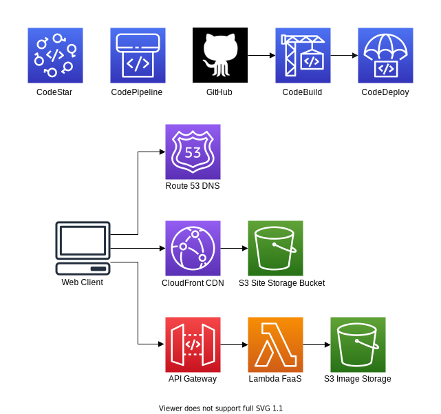
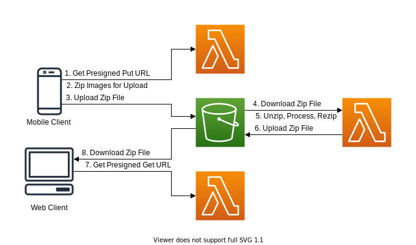
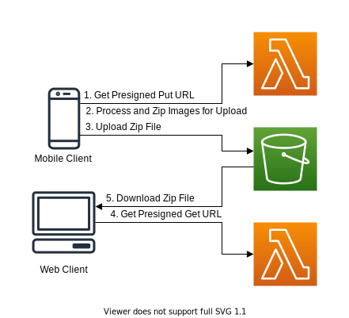

# PicMinder

This project began as the SCU COEN 315 - Web Architecture and Protocols final project. Not surprisingly, it was abandoned the day after it was submitted for a grade. It has since turned into an exercise in converting a serverful web app into its serverless equivalent using AWS managed services.

This repository holds the frontend of the site.

### External links:
- [Website](https://picminder.aleonard.dev)

### Technologies used:
- React.js
- Node.js
- Bootstrap
- AWS CloudFront
- AWS S3
- AWS CodePipeline
- AWS CloudFormation
- AWS API Gateway
- AWS Lambda

### Architecture
Below is a high-level architecture diagram for PicMinder. It is a standard AWS serverless web app with CodeStar continuous deployment.

Below is a more detailed view of the backend architecture that includes the flow from client selection and uploading, through processing, to client downloading.

This flow is suboptimal as it requires a lambda function to process the images. It is necessary if you need to keep the processing code private but is more efficient to perform this processing on the uploading client, as shown below. This is the goal architecture for this project.

### Todo list:
- [ ] Use more React-like components, object hierarchy
- [ ] Use hooks
- [ ] Test
- [ ] Move as much processing to client side as possible
- [ ] Go more into detail with diagrams
